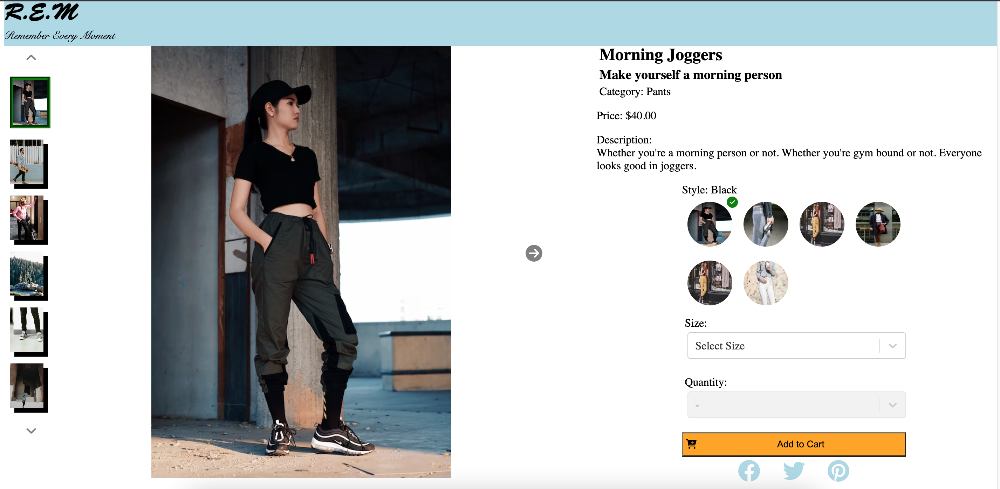

# FrontEndCapstone-EcommercePage

The goal of this project was to create a front end page that could be used for an ecommerce website.

Main tech stack:
  React - Front end
  Axios - API requests
  Express - Back end (mainly used to optimize and to serve to AWS)
  Webpack - To put everything together

## Overview

  The overview is the top module of the webpage and allows the user to get information about the product, browse the styles and optionally add the product to a cart. The elements of this module includes:

  1. Image Gallery
  2. Product Information
  3. Style Selector
  4. Add to Cart

### Image Gallery

Feature: Allows user to browse through different images of the selected style of the selected product. Users may navigate by using thumbnails on the left side of the main image or by using the arrows. Also includes an expanded image function which users can click into and zoom in even further.

Breakdown: Everything is kept track by a react useState. This state exists in a parent component while the actual display of the images exists in children components. Since there is a single state, all image displaying components know exactly what to display!

### Product Information

Feature: Displays information about the product. The information is retrieved via API requests so nothing is hardcoded! Stars are accurate up to quarter star ratings. If an item is on sale, the original price will be crossed out and the new sale price will appear in bright red.

Breakdown: Not too much to breakdown here. The main tech here is simply doing API requests to get information to populate the fields.

### Style Selector

Feature: Shows and allows users to select different styles. Will show all avaliable styles, this also controls how every other element in the module works. For example, image displayed will be based on style selected.

Breakdown: The style state is at the highest level since this state is relevant to EVERY element.
  * Image Gallery: Needs to know style so it knows what image to display
  * Product Information: Needs to know style to know what price to display/if it's on sale.
  * Add To Cart: Needs to know style so it knows what sizes and how much of each quantity is in stock.

### Add to Cart

Feature: Allows user to choose size and quantity to add to cart. If there is no quantity, all options will be greyed out and disabled.

Breakdown: Add to cart options are completely controlled by the style state. Whenever the style state is updated, the Add to Cart component will scan through avaliable options by style and update the dropdown choices accordingly.

